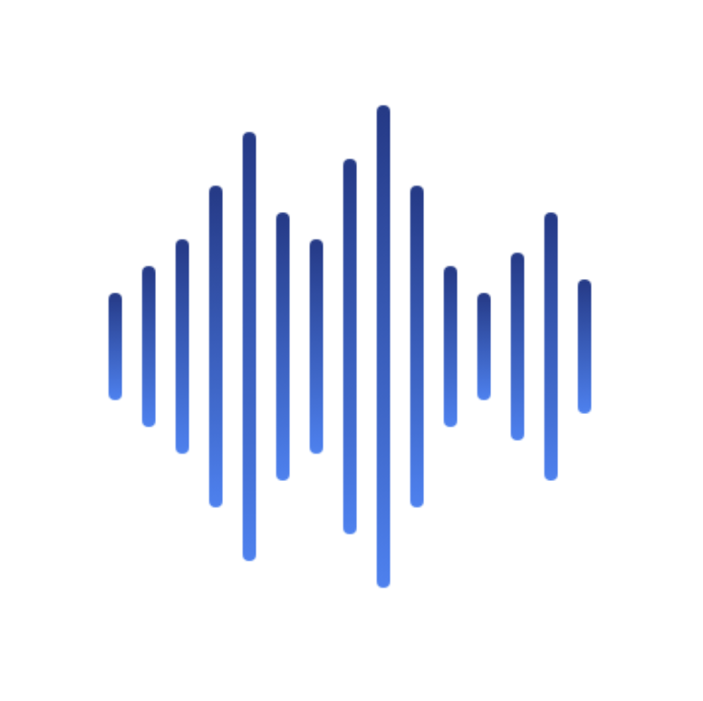

# AcoustiCare

A cross-platform mobile application for remote voice analysis and patient-provider communication in clinical voice assessment.

## Overview

AcoustiCare enables patients to submit voice recordings to healthcare providers while supporting advanced acoustic analysis for voice disorder screening and treatment monitoring. The platform facilitates recording requests, survey distribution, and longitudinal voice quality tracking.

## Tech Stack

**Frontend:** React Native 0.81 + Expo 54, TypeScript, React Navigation, Expo AV
**Backend:** Django 5.2 + DRF 3.16, PostgreSQL, JWT authentication
**Voice Analysis:** Praat-Parselmouth 0.4.6  

## Voice Analysis Capabilities

The platform is designed to integrate acoustic analysis algorithms for clinical voice assessment:

- **Jitter:** Frequency perturbation (local, RAP, PPQ5) - indicates vocal fold irregularity
- **Shimmer:** Amplitude perturbation (local, APQ) - indicates cycle-to-cycle amplitude variation
- And others...

## Features

**Patients:** Voice recording submission, provider connection, recording requests, survey completion
**Providers:** Patient management, recording requests, audio review, survey creation 
**Technical:** JWT auth, cross-platform recording (web/mobile), HTTP range requests for streaming, CORS-enabled API

## Last Updated
Suraj Kumar, 1/5/2026